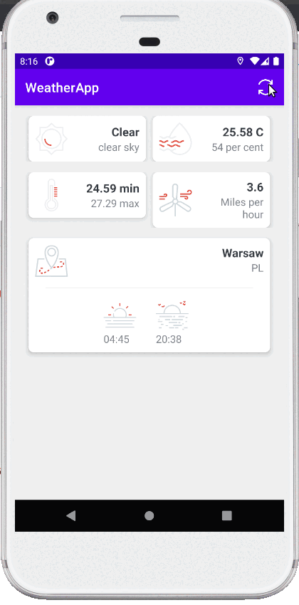

# WeatherApp
Application displays weather information based on users location.

Used technologies:
- asking for permissions with dexter,
- checking for internet connection,
- models for data from https://home.openweathermap.org/,
- call to api https://home.openweathermap.org/,
- progress dialog,
- shared preferences for storing last downloaded data to use when there is no internet connection.

App during work:
 
 
